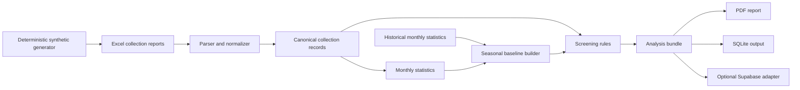

# Architecture

## Goals

Milk Quality Screening converts monthly dairy collection workbooks into
reproducible screening evidence. The design prioritizes traceability, neutral
language, privacy, and the ability to replace storage or presentation layers
without rewriting analytical rules.

The current alpha is intentionally a compact Python application. Its canonical
analysis bundle is the boundary between computation, reporting, and storage.

## System flow

## Components

### Analysis engine

`pipeline.py` owns parsing, normalization, monthly aggregation, historical
baseline construction, screening rules, confidence adjustments, seasonal event
routing, summaries, and canonical bundle generation.

Its main programmatic entry point is `analyze_month(month_df,
historical_month_stats)`. Inputs and intermediate values are pandas data frames;
the returned bundle is JSON-serializable.

### Report renderer

`build_report.py` consumes only the canonical bundle. It does not read raw
workbooks or recompute screening decisions. This separation prevents report
formatting changes from silently changing analytical outcomes.

### Local persistence

`run_pipeline` writes derived tables to SQLite. The database preserves completed
facility-periods and their historical monthly statistics, so an incremental run
uses earlier persisted periods and leaves an already completed period unchanged.
It remains a local single-user workflow; the database is an output and is
excluded from version control. Raw workbooks are never part of the repository.

### Hosted persistence adapter

`supabase_pipeline.py` persists compact monthly statistics, baselines,
screening records, summaries, audit rows, and the canonical bundle through the
Supabase REST API. Credentials come from environment variables and must remain
server-side.

The hosted adapter is optional. The analysis engine and report renderer do not
require Supabase.

### Synthetic demonstration

`synthetic_data.py` generates four chronological `.xlsx` workbooks from a fixed
seed. `demo.py` passes those files through the public parser and local pipeline,
then writes the SQLite database, latest analysis bundle, summary, and PDF report.
The demo does not bypass or mock analytical behavior.

## Canonical data flow

1. `parse_filename` extracts facility and reporting period from a workbook name.
2. `inspect_collection_frame` validates a versioned supported layout, emits a
   schema fingerprint and row-level diagnostics, then `normalize_collection_frame`
   accepts only a fully valid workbook.
3. `compute_society_month_stats` creates compact historical summaries.
4. `build_baselines_from_month_stats` uses only periods before the target month.
5. `apply_rules` produces neutral screening signals.
6. Confidence and shared-event logic adjust review priority.
7. `build_analysis_bundle` records methodology, provenance, results, and actions.
8. Local persistence creates durable review cases for reportable signals.
9. Output adapters consume the bundle without changing the result.

## Key invariants

- No future period may contribute to a target period's baseline.
- Screening categories never identify a substance, intent, or fraud.
- Insufficient history produces calibration mode rather than invented certainty.
- The deprecated repeated-spike rule remains disabled and always emits zero.
- Raw workbooks, databases, generated reports, and credentials remain untracked.
- Report generation consumes derived data only.

## Trust boundaries

| Boundary | Required control |
|---|---|
| Workbook to parser | Validate required columns and numeric coercion; reject unusable schemas |
| Engine to report | Consume the versioned bundle; do not recompute decisions |
| Engine to persistence | Persist only expected derived fields and sanitize missing values |
| Server to Supabase | Keep privileged keys server-side and apply least privilege |
| Repository to contributors | Synthetic or explicitly redistributable fixtures only |

## Current limitations

- Source modules remain flat while the public API stabilizes.
- Input schema detection supports two known layouts and lacks a formal schema registry.
- The local workbook contract supports two layouts; additional vendor exports
  still require a reviewed adapter.
- Supabase requests are synchronous and use a privileged server-side credential.
- There is no user authentication, tenant isolation, job queue, or hosted API yet.
- The compatibility schema still contains legacy field names such as `diagnosis`
  and `confidence`; their values now contain neutral screening categories and
  priorities and are explicitly marked deprecated in the bundle.

## Evolution path

The next architectural boundary is an installable `src/` package with explicit
domain, ingestion, application, and adapter modules. Hosted deployment should
then add an authenticated API, queue-backed workers, private object storage,
PostgreSQL row-level isolation, idempotency keys, and immutable run provenance.
Those additions should preserve the canonical bundle contract and keep the
screening engine independent from infrastructure providers.
